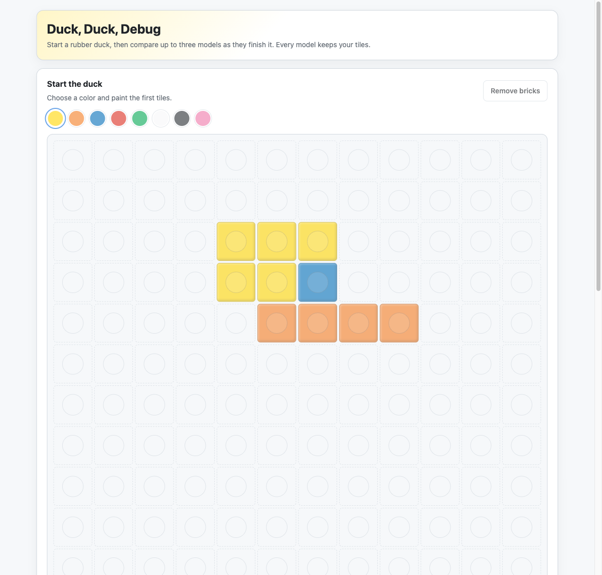
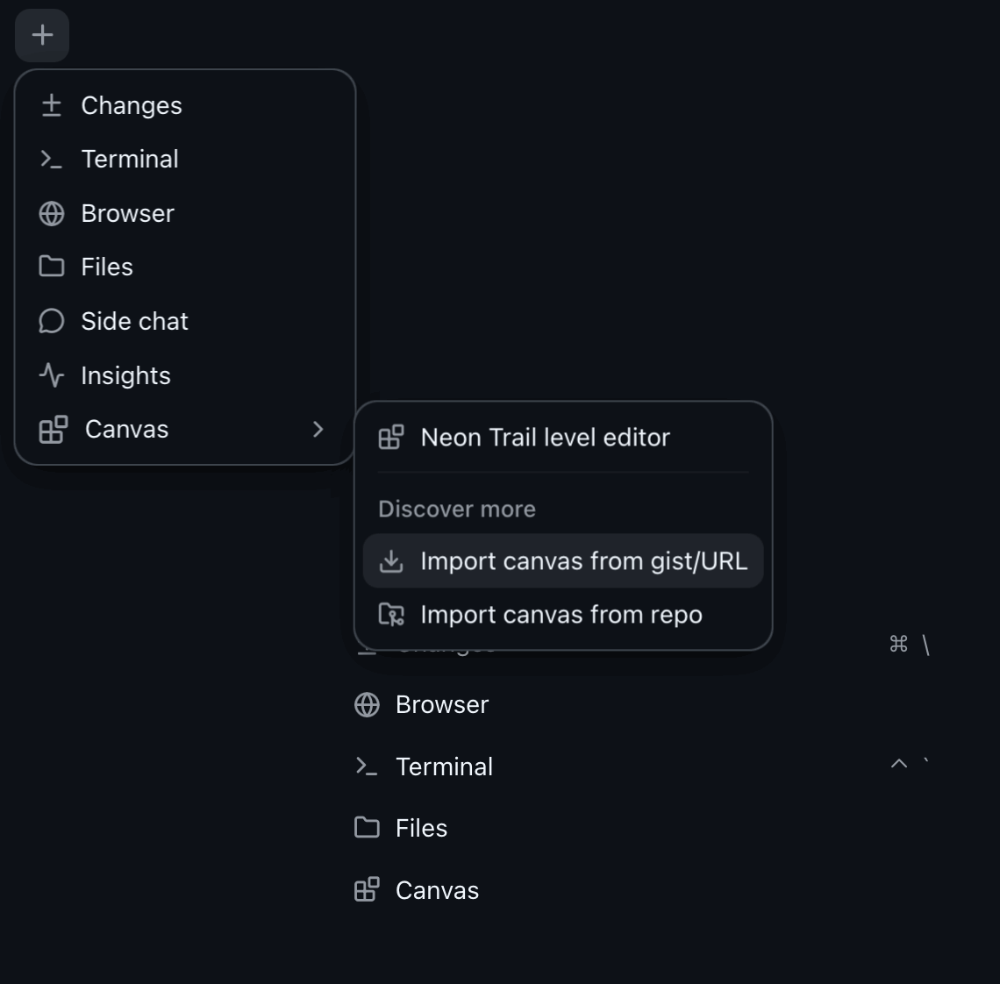
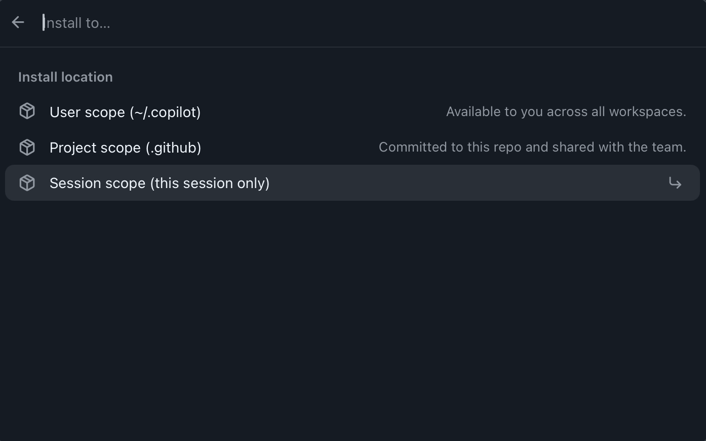
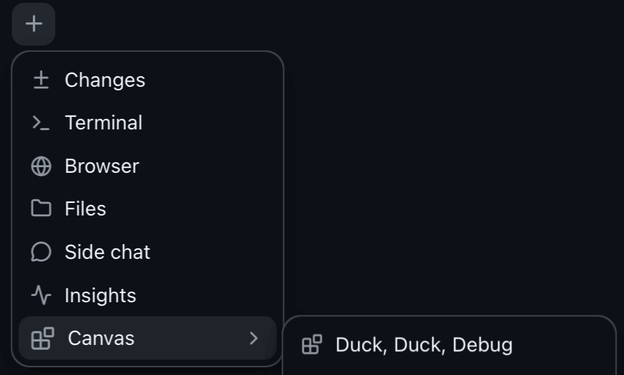

# Duck, Duck, Debug

A Copilot canvas extension: paint a 12x12 brick mosaic of a rubber duck, then
run up to three models in parallel and inspect each board's studs-used and
time-taken metrics.



## Try it

**Option 1 — Clone this repo**

```
git clone https://github.com/CP-Canvas-Demo/duck-duck-debug.git
```

Open the repo in the Copilot App and start a session — the extension loads
automatically from `.github/extensions/brick-canvas/`. Open the **"Duck, Duck,
Debug"** canvas to play.

**Option 2 — Install from the URL**

In any Copilot App session, click ```+``` in the toolbar, and click Import canvas from gist/URL.


```
https://github.com/CP-Canvas-Demo/duck-duck-debug/tree/main/.github/extensions/brick-canvas
```

Choose ```Session scope (this session only)```


Then open the **"Duck, Duck, Debug"** canvas.

